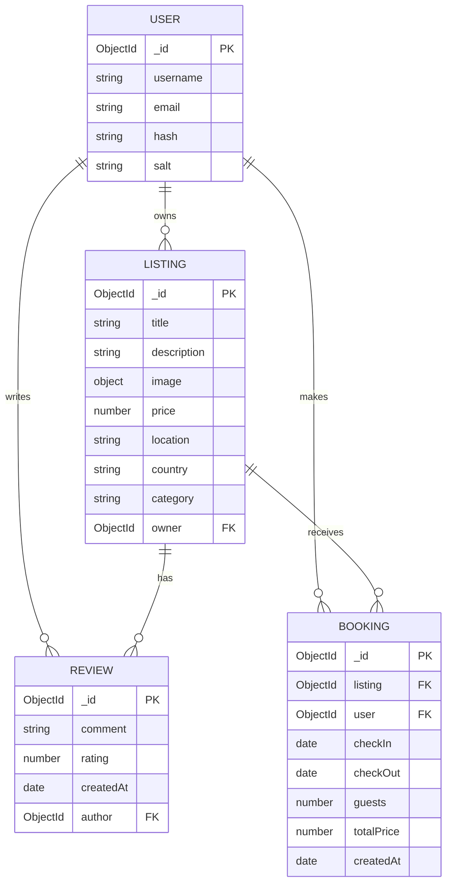

# 🏠 Rentra — Premium Rental Marketplace

[](https://nodejs.org/)
[](https://www.mongodb.com/)
[](https://expressjs.com/)
[](https://opensource.org/licenses/ISC)
[]()
[](https://rentra-ila8.onrender.com/listings)

Rentra is a full-stack rental marketplace inspired by modern vacation rental platforms. It offers a premium, responsive web interface that allows hosts to list their properties and enables travelers to book destinations and share reviews. Built on the robust **MERN (Express/Mongo)** stack with a server-side EJS templating architecture, it features secure authentication, media uploads, database persistence, and a dynamic booking/pricing engine.

🌐 **Live Application:** [https://rentra-ila8.onrender.com/listings](https://rentra-ila8.onrender.com/listings)

---

## ✨ Key Features

### 👤 User Authentication & Security
- **Secure Registration & Login**: Leverages `passport.js` and `passport-local-mongoose` for secure credential verification, password hashing, and user sessions.
- **Authorization Middlewares**: Protects listings and reviews; only authenticated listing owners can modify or delete their properties, and only review authors can delete their reviews.

### 🏡 Listings Management (CRUD)
- **Host Control**: Create, edit, preview, and delete accommodation listings.
- **Dynamic Categories & Filters**: Browse listings categorized under *Trending, Rooms, Mountains, Beach, City, Camping, Homes, Pool, Hotels,* or *Luxury*.
- **Location-Based Search**: Instantly look up destinations by Title, Location, or Country using regex search matching.
- **Cloud-Hosted Media**: Integrates with Cloudinary via `multer` to handle seamless property photo uploads and optimized original image scaling.

### 📅 Advanced Booking Engine
- **Interactive Reservation Card**: Dynamically calculates rental duration and bills in real time when check-in/checkout dates are modified.
- **Pricing Breakdown**: Automatically estimates total costs including subtotal (with customizable extra guest surcharges beyond 2 guests), cleaning fees, and service charges.
- **Reservation Controls**: Restricts booking access to logged-in users and validates booking dates to ensure checkout occurs after check-in.

### 💬 Community Reviews
- **5-Star Rating System**: Simple visual star selector for leaving feedback.
- **Comments Section**: Users can post comments on properties, with average ratings calculated dynamically.

---

## 🛠️ Tech Stack & Tools

* **Frontend**: HTML5, CSS3 (with glassmorphism elements, custom micro-interactions), JavaScript (ES6+), [EJS](https://ejs.co/) (Embedded JavaScript templates with `ejs-mate` layouts), [Bootstrap 5](https://getbootstrap.com/), FontAwesome 6 icons.
* **Backend**: Node.js, Express.js.
* **Database**: MongoDB Atlas, Mongoose ODM.
* **Session Storage**: `connect-mongo` storing session states in MongoDB, `express-session` for session tracking, and `cookie-parser`.
* **Media Cloud**: [Cloudinary](https://cloudinary.com/) (using `multer` and `multer-storage-cloudinary`).
* **Validation**: [Joi](https://joi.dev/) (object schema validation for incoming request payloads).

---

## 📂 Project Directory Structure

```text
rentra/
├── controllers/          # Route controller actions (MVC design)
│   ├── bookings.js       # Handles booking logic
│   ├── listings.js       # Handles listing CRUD and filters
│   ├── reviews.js        # Handles review creations and deletions
│   └── users.js          # Handles signup, login, and sessions
├── models/               # Mongoose Schema Definitions
│   ├── booking.js        # Booking schema
│   ├── listing.js        # Listing schema (post-delete hooks for reviews)
│   ├── review.js         # Review schema
│   └── user.js           # Passport-integrated User schema
├── routes/               # Express Router files
│   ├── booking.js        # Booking routes
│   ├── listing.js        # Listing routes with validators and uploaders
│   ├── review.js         # Review routes with authentication checks
│   └── user.js           # Authentication & user routing
├── init/                 # Database Seeding scripts
│   ├── data.js           # Initial mockup dataset
│   └── index.js          # DB seeding execution script (auto-categorizer)
├── public/               # Static Assets
│   ├── css/              # Custom design stylesheets
│   └── js/               # Client-side validation and reviews scripts
├── views/                # EJS templates
│   ├── bookings/         # Booking list views
│   ├── includes/         # Navbar, footer, and flash alert components
│   ├── layouts/          # EJS-mate base boilerplates
│   ├── listings/         # Listing indexes, creation forms, details
│   ├── users/            # Sign up and Sign in pages
│   └── error.ejs         # Central error visualizer
├── Utils/                # Helper utilities and custom wrappers
│   ├── catchAsync.js     # Express async error catcher
│   └── ExpressError.js   # Custom HTTP exception class
├── app.js                # Core entry point and Express application setups
├── schema.js             # Joi request validation schemas
├── package.json          # Dependency scripts and node configurations
└── .env                  # Environment configurations (local-only)
```

---

## 🗄️ Database Schema Design

The application utilizes MongoDB to store listings, reviews, bookings, and user authentication data. Below is the Entity-Relationship Diagram (ERD) mapping the schemas and their relationships:



---

## 🚀 Installation & Local Setup

### Prerequisites
Make sure you have the following installed on your machine:
- **Node.js** (v18.x or above recommended)
- **MongoDB** (local server running or a free cluster on MongoDB Atlas)

---

### Step-by-Step Guide

#### 1. Clone the Repository
```bash
git clone https://github.com/iqbhavya/rentra.git
cd rentra
```

#### 2. Install Project Dependencies
Run npm install to retrieve required package modules:
```bash
npm install
```

#### 3. Setup Environment Variables
Create a file named `.env` in the `rentra` directory and populate it with your environment keys:
```env
# MongoDB Atlas or local connection URI
ATLASDB_URL=mongodb+srv://<username>:<password>@<cluster>.mongodb.net/rentra?retryWrites=true&w=majority

# Secret phrase for session cookie encryption
SECRET=your_custom_session_secret_key

# Cloudinary credentials for property image uploads
CLOUD_NAME=your_cloudinary_cloud_name
CLOUD_API_KEY=your_cloudinary_api_key
CLOUD_API_SECRET=your_cloudinary_api_secret

# (Optional) Map API Token if maps integrations are active
MAP_TOKEN=your_map_api_token
```

#### 4. Seed the Database
Rentra comes with a database initialization script. Run it to automatically create a default host account and seed sample listings:
```bash
node init/index.js
```
*(This deletes old listings, creates a default host user `superhost`, auto-assigns tags/categories to properties, and inserts them into your MongoDB database)*

#### 5. Launch the Server
Start the Express server:
```bash
node app.js
```

#### 6. Open in Browser
Visit the app in your local browser:
[http://localhost:3000](http://localhost:3000)

---

## 🔒 Environment Variable Specifications

| Variable | Description | Example / Required |
| :--- | :--- | :--- |
| `ATLASDB_URL` | MongoDB connection URL (Atlas or Local Mongo URI) | `mongodb://127.0.0.1:27017/rentra` |
| `SECRET` | Encryption secret string for Express-sessions cookie storage | Any custom cryptographic string |
| `CLOUD_NAME` | Cloudinary name for image hosting bucket | Cloudinary account Dashboard value |
| `CLOUD_API_KEY` | Cloudinary API Key | Cloudinary account Dashboard value |
| `CLOUD_API_SECRET` | Cloudinary API Secret Key | Cloudinary account Dashboard value |

---

## 📜 License

This project is licensed under the **ISC License** — see the [package.json](file:///c:/Users/bhavy/OneDrive/Desktop/Folders/Code/APNA%20COLLEGE%20COURSE/WEB%20DEV/Rentra/rentra/package.json) file for details.

---

## 👤 Author

* **Bhavya Yadav**
* GitHub: [@iqbhavya](https://github.com/iqbhavya)
