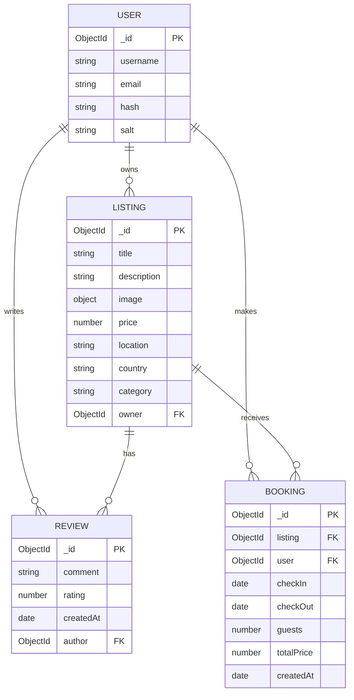

# Rentra — Rental Marketplace

Rentra is a full-stack rental marketplace where hosts can list properties, and users can browse listings, book stays, and leave reviews. Built on Node.js/Express and MongoDB, it features session-based authentication, image uploads, server-side validation, and a booking calculation engine.

**Live Application:** [https://rentra-ila8.onrender.com/listings](https://rentra-ila8.onrender.com/listings)

---

## Key Features

### User Authentication & Security
- **Signup & Login:** Uses `passport.js` and `passport-local-mongoose` to handle authentication, password hashing, and sessions.
- **Authorization Middlewares:** Checks permissions so only listing owners can edit/delete listings, and only review authors can delete reviews.

### Listings Management (CRUD)
- **Host Control:** CRUD operations for property listings (create, edit, view, delete).
- **Categories & Filters:** Browse listings filtered by categories (Trending, Rooms, Mountains, Beach, City, Camping, Homes, Pool, Hotels, Luxury).
- **Location-Based Search:** Regex search to find listings by title, location, or country.
- **Media Uploads:** Image uploads using Multer and Cloudinary integration.

### Booking Engine
- **Pricing Calculator:** Real-time calculation of pricing and rental duration based on selected check-in/checkout dates.
- **Cost Breakdown:** Shows subtotal, extra guest surcharges (for more than 2 guests), cleaning fees, and service fees.
- **Validation:** Restricts booking to authenticated users and validates checkout dates.

### Reviews
- **Rating System:** 5-star rating selection.
- **Comments Section:** Review comments with dynamically calculated average listing ratings.

---

## Tech Stack & Tools

* **Frontend:** HTML5, CSS3, JavaScript, EJS (with `ejs-mate` layouts), Bootstrap 5, FontAwesome 6 icons.
* **Backend:** Node.js, Express.js.
* **Database:** MongoDB Atlas, Mongoose ODM.
* **Session Storage:** `connect-mongo` for session storage in MongoDB, `express-session`, and `cookie-parser`.
* **Media Cloud:** Cloudinary (using `multer` and `multer-storage-cloudinary`).
* **Validation:** Joi (object schema validation for request payloads).

---

## Project Directory Structure

```text
rentra/
├── controllers/          # Route controller actions (MVC design)
│   ├── bookings.js       # Handles booking logic
│   ├── listings.js       # Handles listing CRUD and filters
│   ├── reviews.js        # Handles review creations and deletions
│   └── users.js          # Handles signup, login, and sessions
├── models/               # Mongoose Schema Definitions
│   ├── booking.js        # Booking schema
│   ├── listing.js        # Listing schema (post-delete hooks for reviews)
│   ├── review.js         # Review schema
│   └── user.js           # Passport-integrated User schema
├── routes/               # Express Router files
│   ├── booking.js        # Booking routes
│   ├── listing.js        # Listing routes with validators and uploaders
│   ├── review.js         # Review routes with authentication checks
│   └── user.js           # Authentication & user routing
├── init/                 # Database Seeding scripts
│   ├── data.js           # Initial mockup dataset
│   └── index.js          # DB seeding execution script (auto-categorizer)
├── public/               # Static Assets
│   ├── css/              # Custom design stylesheets
│   └── js/               # Client-side validation and reviews scripts
├── views/                # EJS templates
│   ├── bookings/         # Booking list views
│   ├── includes/         # Navbar, footer, and flash alert components
│   ├── layouts/          # EJS-mate base boilerplates
│   ├── listings/         # Listing indexes, creation forms, details
│   ├── users/            # Sign up and Sign in pages
│   └── error.ejs         # Central error visualizer
├── Utils/                # Helper utilities and custom wrappers
│   ├── catchAsync.js     # Express async error catcher
│   └── ExpressError.js   # Custom HTTP exception class
├── app.js                # Core entry point and Express application setups
├── schema.js             # Joi request validation schemas
├── package.json          # Dependency scripts and node configurations
└── .env                  # Environment configurations (local-only)
```

---

## Database Schema Design

The application utilizes MongoDB to store listings, reviews, bookings, and user authentication data. Below is the Entity-Relationship Diagram (ERD) mapping the schemas and their relationships:


```mermaid
erDiagram
    USER ||--o{ LISTING : "owns"
    USER ||--o{ REVIEW : "writes"
    USER ||--o{ BOOKING : "makes"
    LISTING ||--o{ REVIEW : "has"
    LISTING ||--o{ BOOKING : "receives"

    USER {
        ObjectId _id PK
        string username
        string email
        string hash
        string salt
    }

    LISTING {
        ObjectId _id PK
        string title
        string description
        object image
        number price
        string location
        string country
        string category
        ObjectId owner FK
    }

    REVIEW {
        ObjectId _id PK
        string comment
        number rating
        date createdAt
        ObjectId author FK
    }

    BOOKING {
        ObjectId _id PK
        ObjectId listing FK
        ObjectId user FK
        date checkIn
        date checkOut
        number guests
        number totalPrice
        date createdAt
    }
```

---

## Installation & Local Setup

### Prerequisites
Make sure you have the following installed on your machine:
- **Node.js** (v18.x or above recommended)
- **MongoDB** (local server running or a free cluster on MongoDB Atlas)

---

### Step-by-Step Guide

#### 1. Clone the Repository
```bash
git clone https://github.com/iqbhavya/rentra.git
cd rentra
```

#### 2. Install Project Dependencies
Run npm install to retrieve required package modules:
```bash
npm install
```

#### 3. Setup Environment Variables
Create a file named `.env` in the `rentra` directory and populate it with your environment keys:
```env
# MongoDB Atlas or local connection URI
ATLASDB_URL=mongodb+srv://<username>:<password>@<cluster>.mongodb.net/rentra?retryWrites=true&w=majority

# Secret phrase for session cookie encryption
SECRET=your_custom_session_secret_key

# Cloudinary credentials for property image uploads
CLOUD_NAME=your_cloudinary_cloud_name
CLOUD_API_KEY=your_cloudinary_api_key
CLOUD_API_SECRET=your_cloudinary_api_secret

# Email & Brevo API details for OTP registration verification
EMAIL_USER=your_brevo_sender_email
BREVO_API_KEY=your_brevo_api_key
```

#### 4. Seed the Database
Rentra comes with a database initialization script. Run it to automatically create a default host account and seed sample listings:
```bash
node init/index.js
```
*(This deletes old listings, creates a default host user `superhost`, auto-assigns tags/categories to properties, and inserts them into your MongoDB database)*

#### 5. Launch the Server
Start the Express server:
```bash
node app.js
```

#### 6. Open in Browser
Visit the app in your local browser:
[http://localhost:3000](http://localhost:3000)

---

## Environment Variables

| Variable | Description | Example / Required |
| :--- | :--- | :--- |
| `ATLASDB_URL` | MongoDB connection URL | `mongodb://127.0.0.1:27017/rentra` |
| `SECRET` | Express session cookie encryption secret | Any custom cryptographic string |
| `CLOUD_NAME` | Cloudinary cloud name | Cloudinary account Dashboard value |
| `CLOUD_API_KEY` | Cloudinary API Key | Cloudinary account Dashboard value |
| `CLOUD_API_SECRET` | Cloudinary API Secret Key | Cloudinary account Dashboard value |
| `EMAIL_USER` | Brevo sender email address | `example@domain.com` |
| `BREVO_API_KEY` | Brevo API key for SMTP emails | Brevo transaction mail API key |

---

## License

This project is licensed under the **ISC License** — see the [package.json](package.json) file for details.

---

## Author

* **Bhavya Yadav**
* GitHub: [@iqbhavya](https://github.com/iqbhavya)
